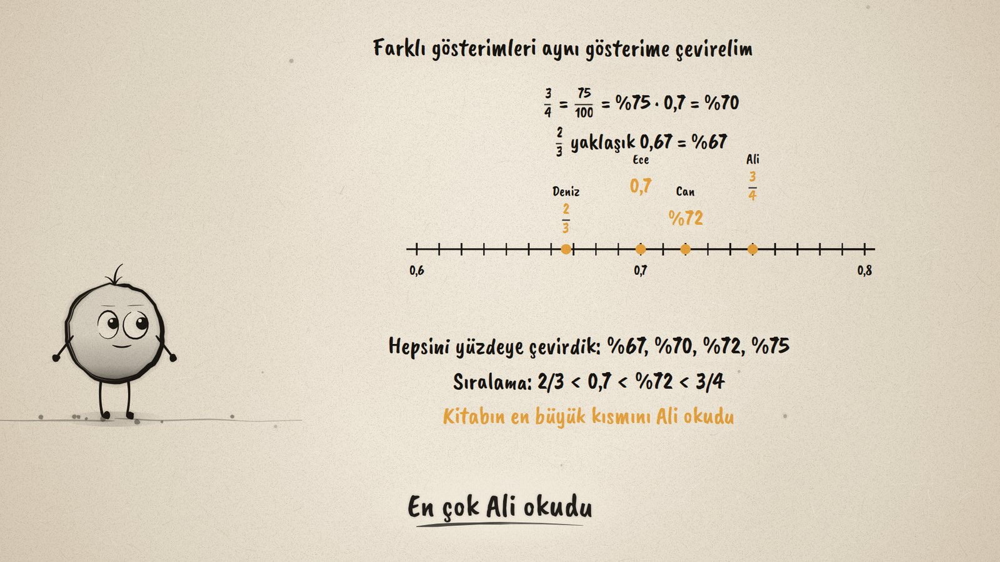
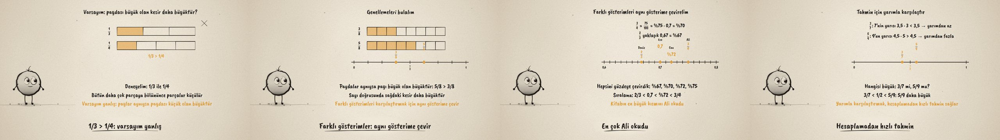

# Hangisi Büyük? · Comparing Fractions

**▶ Tarayıcıda izleyin / Watch in the browser:** https://hakanatas.github.io/hangisi-buyuk/ 
**⬇ MP4 + altyazılar / MP4 + subtitles:** [Releases](https://github.com/hakanatas/hangisi-buyuk/releases) 
**✎ Kullanılan istem / The prompt behind it:** [PROMPT.md](PROMPT.md) 
**🎞 Bütün filmler / All films:** [Nokta'nın Filmleri](https://hakanatas.github.io/nokta-filmleri/?sinif=5)

> **TR —** 5. sınıf matematik "Sayılar ve Nicelikler" temasındaki MAT.5.1.4 öğrenme çıktısı için hazırlanmış, tamamen JavaScript ile çizilen 92 saniyelik mürekkep animasyonu. Dört arkadaş aynı kitabı okuyor: Ali 3/4'ünü, Ece 0,7'sini, Can %72'sini, Deniz 2/3'ünü. Kim daha çok okudu? Bir varsayım sınanıyor ("paydası büyük olan kesir daha büyüktür"): 1/3 ile 1/4 şeritleri varsayımı çürütüyor; paylar aynıysa paydası küçük olan büyük. Genellemeler şerit ve sayı doğrusunda gösteriliyor: paydalar aynıysa payı büyük olan büyük (5/8 > 3/8), sayı doğrusunda sağdaki büyük. Farklı gösterimler yüzdeye çevriliyor (%67, %70, %72, %75), sayı doğrusu 0,6–0,8 arasına yakınlaşıyor: en çok Ali okumuş. Son olarak yarımla karşılaştırma bir tahmin aracı olarak sunuluyor: 3/7 yarımdan az, 5/9 yarımdan fazla. Altyazılar Türkçe, İngilizce ya da ikisi birlikte seçilebilir.

A 92-second ink animation for **5th-grade maths**. Nokta, the ink character from [The Learning Ink](https://github.com/hakanatas/the-learning-ink), is the guide again. The number line is one function with a range (`line` in `scenes/scene1.js`); zooming from 0–1 to 0.6–0.8 just changes that range, so 2/3, 0.7, 72% and 3/4 spread apart where they can be told apart.

## Learning outcome

MEB, Türkiye Yüzyılı Maarif Modeli, Ortaokul Matematik, 5th grade, "Sayılar ve Nicelikler" theme:

**MAT.5.1.4. Farklı gösterimlerle ifade edilen kesirlerin karşılaştırılmasına yönelik çıkarım yapabilme**
- a) Farklı gösterimlerle ifade edilen kesirlerin karşılaştırılmasına yönelik varsayımda bulunur.
- b) Varsayımındaki ilişkileri inceleyerek kesirlerin karşılaştırılmasına yönelik genellemeleri belirler.
- c) Elde ettiği genellemelerin varsayımını karşılayıp karşılamadığını sayı doğrusu, şekil gibi temsiller üzerinde gösterir.
- ç) Varsayımı ile ilgili ulaştığı sonuca yönelik matematiksel önermeleri sözel ya da sembolik temsil ile sunar.
- d) Sunduğu önermelerin tahmin etme becerisine katkısını gerekçelerle açıklar.

## Scenes

| # | Time | Scene | What happens | Outcome |
|---|---|---|---|---|
| 1 | 0–10 s | Kim daha çok okudu? | 3/4, 0.7, 72%, 2/3 of the same book. | a |
| 2 | 10–28 s | Varsayım | "A bigger denominator is bigger?" 1/3 and 1/4 strips say no. | a, c |
| 3 | 28–46 s | Genellemeler | Same denominator: bigger numerator; shown on strips and a number line. | b, c, ç |
| 4 | 46–64 s | Aynı gösterim | All as percents, the number line zooms to 0.6–0.8: Ali read the most. | b, c, ç |
| 5 | 64–80 s | Tahmin | 3/7 or 5/9? Compare each with a half. | ç, d |
| 6 | 80–92 s | Aklında kalsın | Rules for comparing, and the half as a benchmark. | ç, d |

## Running it

- **Preview:** double-click `index.html` (it works offline).
- **MP4:** run `npm install` once, then `npm run export -- --format=horizontal --captions=tr`.
- **Subtitles and narration:** `npm run srt` writes `out/captions_*.srt` and `narration_notes.txt`.
- **Editing:**
  - Caption text, timings and narration notes: `captions.js`
  - Everything on screen is drawn by `LI.world(t)` in `scenes/scene1.js` (the reading bars, the fraction strips, the number line, the words); the other scenes only set the camera.
  - Fractions in text and Nokta's poses: `src/draw/film.js`; layout for 16:9 and 9:16: `src/draw/kd.js`

It uses the same engine as The Learning Ink: `renderFrame(t)` as a pure function of time, seeded randomness, and frame-by-frame export.

## Lisans · License

**TR —** Bu film ve kodu [Creative Commons Atıf-GayriTicari 4.0 Uluslararası (CC BY-NC 4.0)](https://creativecommons.org/licenses/by-nc/4.0/deed.tr) lisansıyla paylaşılır. Ticari olmayan her amaçla (derste, okulda, eğitim materyalinde) kopyalayabilir, paylaşabilir ve değiştirebilirsiniz; ancak **kaynak göstermek zorunludur**: eser sahibinin adı ve bu deponun bağlantısı belirtilmeden kullanılamaz. Ticari kullanım (satış, ücretli ürün ya da yayın) için izin alınmalıdır.

**EN —** This film and its code are licensed under [Creative Commons Attribution-NonCommercial 4.0 International (CC BY-NC 4.0)](https://creativecommons.org/licenses/by-nc/4.0/). You may copy, share and adapt them for non-commercial purposes, but **attribution is required**: they may not be used without crediting the author and linking to this repository. Commercial use requires permission.

Atıf örneği / Required credit: *“Hangisi Büyük?”, Hakan Ataş, Nokta'nın Filmleri — https://github.com/hakanatas/hangisi-buyuk — CC BY-NC 4.0*
